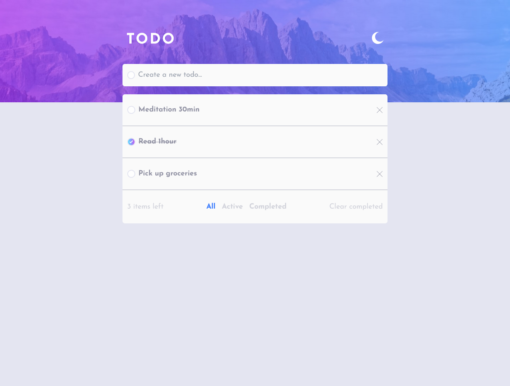
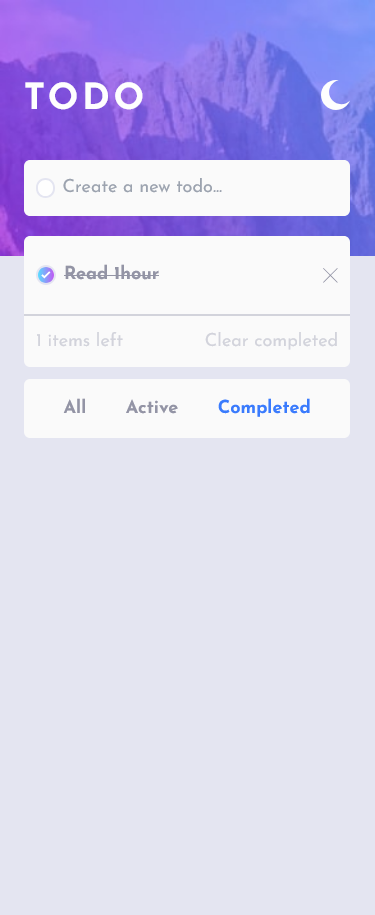
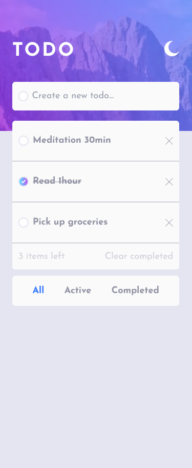
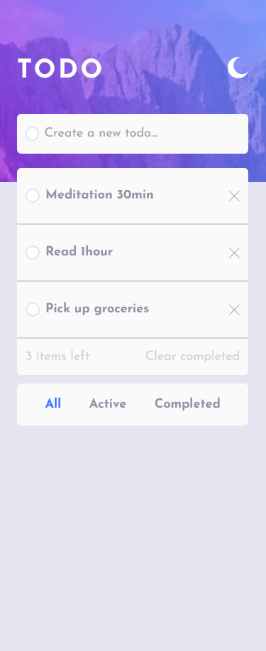

# Frontend Mentor - Todo app solution

This is a solution to the [Todo app challenge on Frontend Mentor](https://www.frontendmentor.io/challenges/todo-app-Su1_KokOW). Frontend Mentor challenges help you improve your coding skills by building realistic projects. 

## Table of contents

- [Overview](#overview)
  - [The challenge](#the-challenge)
  - [Screenshot](#screenshot)
  - [Links](#links)
- [My process](#my-process)
  - [Built with](#built-with)
  - [Continued development](#continued-development)
- [Author](#author)

## Overview

### The challenge

Users should be able to:

- View the optimal layout for the app depending on their device's screen size
- See hover states for all interactive elements on the page
- Add new todos to the list
- Mark todos as complete
- Delete todos from the list
- Filter by all/active/complete todos
- Clear all completed todos
- Toggle light and dark mode

### Screenshot

  

### Links

- Solution URL: [Github](https://github.com/Tonyac-create/todo-app)
- Live Site URL: [Vercel](https://todo-app-psi-jet.vercel.app/)

## My process

### Built with

- TailwindCSS
- Mobile-first workflow
- [Next.js](https://nextjs.org/) - React framework

### Continued development

Next step: TODO => Drag and drop to reorder items on the list

## Author

- LinkedIn - [Angelique Copere](https://www.linkedin.com/in/angelique-copere-dev/)
- CV Notion - [Angelique Copere](https://www.notion.so/Ang-lique-Cop-r-D-veloppeur-web-front-11f53c9673b743b091f5858210033e8a)
- Frontend Mentor - [@Tonyac-create](https://www.frontendmentor.io/profile/Tonyac-create)

## Deploy on Vercel

The easiest way to deploy your Next.js app is to use the [Vercel Platform](https://vercel.com/new?utm_medium=default-template&filter=next.js&utm_source=create-next-app&utm_campaign=create-next-app-readme) from the creators of Next.js.

Check out our [Next.js deployment documentation](https://nextjs.org/docs/deployment) for more details.
